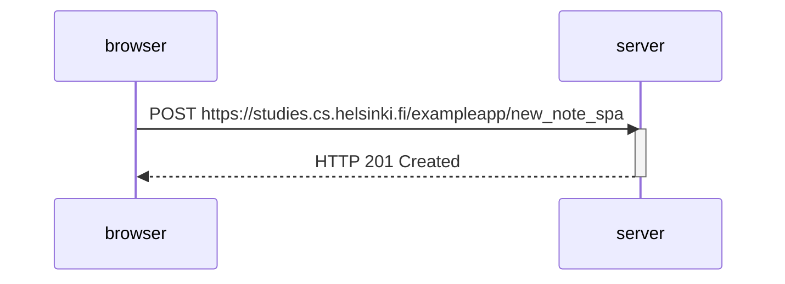

# Exercise 0.6: New note in Single page app diagram

This sequence diagram depicts the situation where the user creates a new note using the single-page version of the app:

The server just responds with the 201 status code and doesn't ask for a redirect. This is because the data was sent using the JavaScript code instead of the traditional way.
